# ContextKeeper: AI-Powered Memory Layer for Development Teams

  

## Introduction

Ever wondered "Why did we make this architectural decision?" or "Who worked on this feature and what was their reasoning?" As development teams grow and projects evolve, institutional knowledge gets scattered across GitHub commits, Slack conversations, and documentation. **ContextKeeper** solves this problem by acting as an AI-powered memory layer that connects your development tools and provides contextual answers to your team's questions.

ContextKeeper is a local-first AI agent that seamlessly integrates GitHub, Slack, and Notion to build a comprehensive knowledge graph of your codebase. It uses advanced AI models and Retrieval-Augmented Generation (RAG) to answer the "why" behind code decisions, not just the "what."

## 🎯 The Problem We're Solving

Modern development teams face several challenges:

- **Knowledge Silos**: Important decisions are scattered across commits, Slack threads, and documentation
- **Context Loss**: When team members leave or switch projects, valuable context disappears
- **Onboarding Friction**: New developers struggle to understand the reasoning behind architectural choices
- **Decision Archaeology**: Finding out why a particular technology was chosen requires digging through months of history

ContextKeeper addresses these pain points by creating a unified, queryable knowledge base that preserves and surfaces your team's collective intelligence.

## ✨ Key Features

### 🔒 Robust Error Handling
Automatic retries, rate limit handling, and graceful error recovery ensure reliable operation even with external API fluctuations.

### 💬 Multi-Source Integration
- **GitHub**: Commits, pull requests, issues, and code changes
- **Slack**: Team discussions, decisions, and collaboration context
- **Notion**: Documentation updates and knowledge base changes

### 🕸️ Real Knowledge Graph
Automatically discovers and visualizes relationships between:
- People (authors, contributors)
- Code modules and files
- Technologies and frameworks
- Architectural decisions
- Temporal relationships

### 🗂️ Multi-Repository Support
Separate ChromaDB instances for each repository with branch-level granularity (Path: `./chroma_db_{repository_name}_{branch_name}`).

### 🤖 Context-Aware AI Answers
Powered by Hugging Face's Llama-3.2-3B-Instruct model and SentenceTransformer embeddings for accurate, context-rich responses.

### 📊 Interactive Visualizations
- **2D Knowledge Graph**: Force-directed graph with interactive zoom and pan
- **3D Knowledge Graph**: Immersive Three.js visualization with camera controls
- **AI Agents Dashboard**: Real-time insights from GitHub, Slack, and Notion
- **Decision Engine**: AI-powered priority classification and recommendations

## 🏗️ Architecture

ContextKeeper follows a modern multi-tier architecture designed for scalability and maintainability:

```mermaid
graph TB
    subgraph UI["User Interface Layer<br/>(React + Vite + TypeScript)"]
        QueryInterface[Query Interface]
        KnowledgeGraph[Knowledge Graph]
        AIAgents[AI Agents]
        BranchSelector[Branch Selector]
        SyncStatus[Sync Status]
    end
    
    subgraph API["API Gateway Layer<br/>(Express.js - Node.js)<br/>Port 5173 → 3000"]
        REST[REST API Endpoints<br/>Query, Knowledge Graph,<br/>Sync, Status, AI Agents,<br/>Branches, Config]
    end
    
    subgraph Python["AI Processing Layer<br/>(Python 3.9+)"]
        subgraph Collectors[Data Collectors]
            GithubCollector[github_collector]
            SlackCollector[slack_collector]
            NotionCollector[notion_collector]
            RAGEngine[rag_engine]
            KG[knowledge_graph]
        end
        
        subgraph Agents[AI Agents]
            GithubAgent[github_agent]
            SlackAgent[slack_agent]
            NotionAgent[notion_agent]
            AISummarizer[ai_summarizer]
            DecisionEngine[decision_engine]
        end
    end
    
    subgraph Storage[Storage Layer]
        MongoDB[(MongoDB<br/>Metadata & Decisions)]
        ChromaDB[(ChromaDB<br/>Vector Store<br/>Per Repo/Branch)]
    end
    
    subgraph Workflow["Workflow Orchestration Layer<br/>(Kestra + Docker)"]
        AutoWorkflows[Automated Workflows<br/>• Data collection scheduling<br/>• AI analysis pipelines<br/>• Multi-agent orchestration]
    end
    
    UI -->|HTTP/REST| API
    API -->|child_process.spawn| Python
    Python --> Storage
    Workflow -.->|Orchestrates| Python
```



### Technology Stack

**Frontend:**
- React 19 with TypeScript
- Vite for blazing-fast builds
- Bootstrap 5 for responsive UI
- React Force Graph (2D/3D) for visualizations
- Three.js for 3D rendering

**Backend:**
- Node.js + Express.js API server
- Python 3.9+ for AI processing
- MongoDB for metadata storage
- ChromaDB for vector embeddings

**AI/ML:**
- Hugging Face Llama-3.2-3B-Instruct
- Sentence Transformers for embeddings
- RAG (Retrieval-Augmented Generation)

**Orchestration:**
- Kestra for workflow automation
- Docker & Docker Compose

## 🚀 How It Works

### 1. Data Collection

ContextKeeper collects data from multiple sources in parallel:

```
┌─────────────────────────────────────────────┐
│         Parallel Data Collection            │
├──────────────┬──────────────┬───────────────┤
│    Slack     │    GitHub    │    Notion     │
│  Messages    │  Commits     │    Pages      │
│  Threads     │  Issues      │  Updates      │
│  Users       │  PRs         │               │
└──────┬───────┴──────┬───────┴───────┬───────┘
       │              │               │
       └──────────────┴───────────────┘
```

**GitHub Collector:**
- Fetches commits, branches, PRs, and issues
- Extracts metadata (author, date, files changed)
- Supports incremental sync (only new commits)
- Multi-branch support with local caching

**Slack Collector:**
- Collects messages and threads from configured channels
- Extracts user information and conversation context
- Preserves thread relationships

**Notion Collector:**
- Monitors documentation pages
- Tracks updates and changes
- Preserves knowledge base structure

### 2. AI Processing & Embedding

All collected data is processed through the AI pipeline:

1. **Text Extraction**: Meaningful content is extracted from each source
2. **Embedding Generation**: SentenceTransformer creates 384-dimensional vectors
3. **Vector Storage**: Embeddings stored in ChromaDB (separate collection per repo/branch)
4. **Metadata Indexing**: Structured data stored in MongoDB

### 3. Knowledge Graph Construction

The knowledge graph builder automatically:

**Extracts Entities:**
- Commits (from commit messages and SHAs)
- Authors (from commit metadata)
- Files (from changed files with paths)
- Technologies (from file extensions, imports, dependencies)
- Decisions (from commit messages with keywords like "decided", "chose", "selected")

**Creates Relationships:**
- `Author → Commit` (authored)
- `Commit → File` (modified)
- `File → Technology` (uses)
- `Commit → Decision` (decided)
- Temporal relationships with timestamps

**Assigns Confidence Scores:**
Each relationship includes a confidence score based on:
- Context clarity
- Semantic analysis
- Frequency of occurrence

### 4. RAG Query Processing

When you ask a question:

1. **Question Embedding**: Your question is converted to a vector
2. **Semantic Search**: ChromaDB finds the most relevant documents
3. **Context Assembly**: Top-k documents are assembled into context
4. **AI Generation**: Llama model generates an answer using the context
5. **Source Attribution**: Response includes sources, related people, and timeline

### 5. AI Agents & Decision Engine

**AI Agents** analyze activity across sources:
- **GitHub Agent**: Commit patterns, PR velocity, issue trends
- **Slack Agent**: Discussion topics, team sentiment, blockers
- **Notion Agent**: Documentation gaps, update frequency

**Decision Engine** provides:
- Priority classification (Critical, High, Medium, Low)
- Automated recommendations
- Blocker identification
- Trend analysis

## 🎨 User Interface

### Query Interface
Ask natural language questions and get context-aware answers:
- "Why did we choose MongoDB?"
- "Who worked on authentication?"
- "What are the recent changes to the API?"

Responses include:
- AI-generated answer with markdown formatting
- Source commits and files
- Related people and contributors
- Timeline of relevant changes

### Knowledge Graph Visualization

**2D View:**
- Interactive force-directed graph
- Color-coded nodes by type
- Zoom, pan, and click interactions
- Real-time force simulation

**3D View:**
- Immersive Three.js visualization
- Camera controls (rotate, zoom, pan)
- Hover tooltips
- Particle effects for enhanced depth perception

**Node Types:**
- 🔵 Commits
- 🟢 Authors
- 🟠 Files
- 🟣 Technologies
- 🔴 Decisions

### AI Agents Dashboard

View comprehensive summaries with:
- Date range filters (24h, 7d, 30d, month, year, all-time)
- Agent-specific insights
- Unified AI summary across all sources
- Decision engine recommendations
- Professional markdown rendering

### Sync Status & Management

Monitor and control data synchronization:
- ChromaDB document count
- MongoDB connection status
- Sync all branches or current branch
- Update notifications
- Real-time progress indicators

## 🔧 Kestra Workflow Orchestration

ContextKeeper leverages **Kestra** for powerful workflow automation:

### Unified ContextKeeper Flow

The main workflow (`unified-contextkeeper-flow-v2.yml`) orchestrates:

1. **Parallel Data Collection** from Slack, GitHub, and Notion
2. **AI Context Preparation** aggregating all sources
3. **AI Agent Analysis** using Meta's Llama 3.1 70B model
4. **Decision Processing** with structured priority classification
5. **Report Generation** with actionable recommendations

### AI Decision Framework

The AI agent evaluates data using this priority classification:

- **CRITICAL**: Security issues, system-down scenarios, critical bugs
- **HIGH**: Development blockers, unanswered urgent questions, stale PRs
- **MEDIUM**: Regular issues, ongoing development tasks
- **LOW**: Documentation, informational updates

### Scheduling & Automation

Workflows can be scheduled for automatic execution:

```yaml
triggers:
  - id: daily_analysis
    type: io.kestra.plugin.core.trigger.Schedule
    cron: "0 9 * * *"  # 9 AM daily
    disabled: false
```

### Available Workflows

- **unified-contextkeeper-flow-v2.yml**: Complete end-to-end analysis
- **agentic-ai-summarizer.yaml**: Advanced AI summarization with autonomous decisions
- **agent-orchestrator.yaml**: Multi-agent coordination
- **github-collector.yaml**: Standalone GitHub data sync
- **slack-collector.yaml**: Standalone Slack data sync
- **knowledge-graph.yaml**: Knowledge graph generation
- **auto-responder.yaml**: Automated team notifications

**Requirement:** Use Kestra's built-in AI Agent to summarize data and make decisions.

**Implementation:**
- The `unified-contextkeeper-flow-v2.yml` workflow uses `io.kestra.plugin.ai.completion.ChatCompletion`
- Powered by `meta-llama/Llama-3.1-70B-Instruct` model
- Summarizes team activity across Slack, GitHub, and Notion
- Identifies urgent items (bugs, blockers)
- Generates structured decision reports (`ai_decisions.json`)
- Categorizes items as CRITICAL, HIGH, MEDIUM, or LOW
- Recommends specific actions based on AI analysis

**Requirement:** Use Cline CLI to build powerful autonomous coding workflows.

**Implementation:**
- ContextKeeper acts as the "memory layer" for autonomous agents like Cline
- Provides context needed for informed code changes
- `.github/workflows/cline-responder.yml` enables autonomous interactions
- Cline can be triggered to respond to repository events
- Effectively acts as an autonomous maintainer with full context

**Requirement:** Best open-source engineering using CodeRabbit.

**Implementation:**
- Fully integrated CodeRabbit for autonomous PR reviews
- Custom `.coderabbit.yaml` configuration:
  - High-level summaries and detailed code review
  - Auto-reply to chat interactions (`chat.auto_reply: true`)
  - Stringent checks (shellcheck, actionlint, eslint, prettier)
- Immediate feedback on every Pull Request
- Ensures high code quality and documentation standards

## 📖 Use Cases

### Daily Standup Preparation
Automated summaries of team activity across all platforms help teams prepare for standups with comprehensive context.

### Sprint Planning
Analysis of completed work, blockers, and trends informs better sprint planning decisions.

### Incident Response
Quick identification of critical issues and related context enables faster incident resolution.

### Team Health Monitoring
Track communication patterns, collaboration metrics, and identify potential bottlenecks.

### Technical Debt Management
Identify stale PRs, unresolved issues, and documentation gaps automatically.

### Onboarding New Developers
New team members can query the system to understand architectural decisions and historical context.

### Knowledge Preservation
Preserve institutional knowledge even as team members come and go.

## 🚀 Getting Started

### Prerequisites

- Docker & Docker Compose
- Node.js (v16+)
- Python (v3.9+)
- MongoDB (local or Atlas URI)
- API Keys:
  - Hugging Face API key
  - GitHub Personal Access Token
  - Slack Bot Token (optional)
  - Notion Integration Token (optional)

### Quick Installation

**1. Clone the repository:**
```bash
git clone https://github.com/yadnyeshkolte/ContextKeeper.git
cd ContextKeeper
```

**2. Backend Setup:**
```bash
cd backend
npm install
python -m venv venv
venv\Scripts\activate  # Windows
# source venv/bin/activate  # macOS/Linux
pip install -r requirements.txt
cp .env.example .env
# Edit .env with your API keys
npm start
```

**3. Frontend Setup:**
```bash
cd frontend
npm install
cp .env.example .env
# Edit .env with backend URL
npm run dev
```

**4. Kestra Setup (Optional):**
```bash
# my testing kestra server with docker

docker-compose --env-file .env up -d

#for windows - local kestra server with docker

docker run --pull=always --rm -it -p 8080:8080 --user=root ^
    -e HUGGINGFACE_API_KEY=hf_your_token_here ^
    -v "/var/run/docker.sock:/var/run/docker.sock" ^
    -v "C:/Temp:/tmp" kestra/kestra:latest server local
```

### First Query

1. Navigate to `http://localhost:5173`
2. Sync your repository data (Sync Status tab)
3. Ask a question: "Why did we choose React?"
4. Explore the knowledge graph visualization
5. Run AI agents for deeper insights

## 📊 API Endpoints

ContextKeeper provides a comprehensive REST API:

### Core Endpoints

- `POST /api/query` - RAG query processing
- `GET /api/knowledge-graph` - Knowledge graph data
- `GET /api/status` - System status (ChromaDB & MongoDB)
- `GET /api/config` - Default repository configuration

### Data Synchronization

- `POST /api/sync-repo` - Sync all branches
- `POST /api/sync-data` - Sync specific branch
- `POST /api/collect/slack` - Collect Slack messages
- `POST /api/collect/github` - Collect GitHub data

### Branch Management

- `GET /api/branches` - List available branches
- `GET /api/check-updates` - Check for new commits

### AI Agents

- `POST /api/agents/github` - Run GitHub analysis
- `POST /api/agents/slack` - Run Slack analysis
- `POST /api/agents/notion` - Run Notion analysis
- `POST /api/agents/summarize` - Run unified summarizer
- `POST /api/agents/decide` - Run decision engine
- `GET /api/agents/job/:jobId` - Get agent job status

## 🔐 Security & Best Practices

- **Local-First Architecture**: Your data stays on your infrastructure
- **API Token Security**: All tokens stored in environment variables
- **Minimal Scopes**: Slack bot uses only required permissions
- **Rate Limit Handling**: Automatic retry with exponential backoff
- **Error Recovery**: Graceful degradation on API failures

## 🌟 What Makes ContextKeeper Unique

### 1. True Multi-Source Integration
Unlike tools that focus on a single source, ContextKeeper unifies GitHub, Slack, and Notion into a single queryable knowledge base.

### 2. Branch-Aware Context
Separate vector databases per repository and branch ensure accurate, context-specific answers.

### 3. Real Knowledge Graph
Not just a visualization—ContextKeeper builds a true semantic graph with confidence scores and temporal relationships.

### 4. AI-Powered Decision Engine
Goes beyond simple summarization to provide actionable recommendations with priority classification.

### 5. Workflow Orchestration
Kestra integration enables powerful automation and scheduling capabilities.

### 6. Developer-Friendly
Comprehensive API, detailed documentation, and modular architecture make it easy to extend and customize.

## 📈 Performance & Scalability

- **Incremental Sync**: Only new commits are processed, reducing API calls
- **Caching**: Knowledge graph cached with 5-minute TTL
- **Connection Pooling**: MongoDB connection pooling for efficiency
- **Batch Processing**: Large datasets processed in batches
- **Lazy Loading**: Frontend components loaded on demand
- **Code Splitting**: Vite automatically splits code by route

## 🤝 Contributing

We welcome contributions! Here's how to get involved:

1. Fork the repository
2. Create a feature branch (`git checkout -b feature/amazing-feature`)
3. Make your changes
4. Test thoroughly
5. Commit with clear messages (`git commit -m 'Add amazing feature'`)
6. Push to your branch (`git push origin feature/amazing-feature`)
7. Open a Pull Request

See [CONTRIBUTING.md](CONTRIBUTING.md) for detailed guidelines.

## 📚 Documentation

- **[Main README](README.md)** - Complete overview and quick start
- **[Developer Guide](docs/DEVELOPER_GUIDE.md)** - Architecture and development
- **[Backend Documentation](backend/README.md)** - API and Python scripts
- **[Frontend Documentation](frontend/README.md)** - React components and UI
- **[Kestra Workflows](kestra/README.md)** - Workflow orchestration
- **[API Reference](docs/api.md)** - Complete API documentation
- **[Troubleshooting](docs/troubleshooting.md)** - Common issues and solutions

## 🙏 Acknowledgments

- **Hugging Face** for providing amazing open-source AI models
- **Kestra** for the powerful workflow orchestration platform
- **Meta** for the Llama model family
- **The Open Source Community** for the incredible tools and libraries

## 📄 License

This project is licensed under the Apache 2.0 License - see the [LICENSE](LICENSE) file for details.

## 👤 Author

**Yadnyesh Kolte**
- GitHub: [@yadnyeshkolte](https://github.com/yadnyeshkolte)
- Email: yadnyeshkolte@gmail.com
- Repository: [ContextKeeper](https://github.com/yadnyeshkolte/ContextKeeper)

## 🚀 Try It Now!

Ready to give your development team an AI-powered memory? Clone the repository and get started in minutes:

```bash
git clone https://github.com/yadnyeshkolte/ContextKeeper.git
cd ContextKeeper
# Follow the installation guide above
```

## 💬 Support & Community

- **Issues**: [GitHub Issues](https://github.com/yadnyeshkolte/ContextKeeper/issues)
- **Discussions**: Open an issue with the `question` label
- **Bug Reports**: Use the `bug` label
- **Feature Requests**: Use the `enhancement` label

---

**Built with ❤️ by developers, for developers**

*ContextKeeper - Because every line of code has a story, and every decision deserves to be remembered.*
